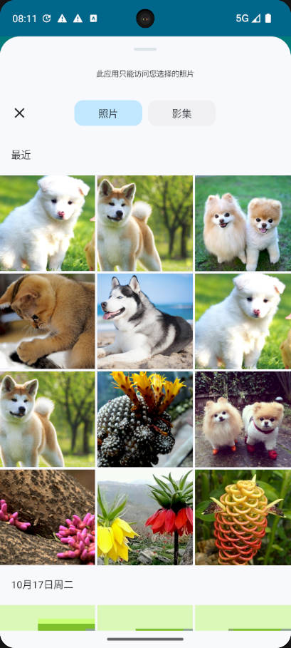
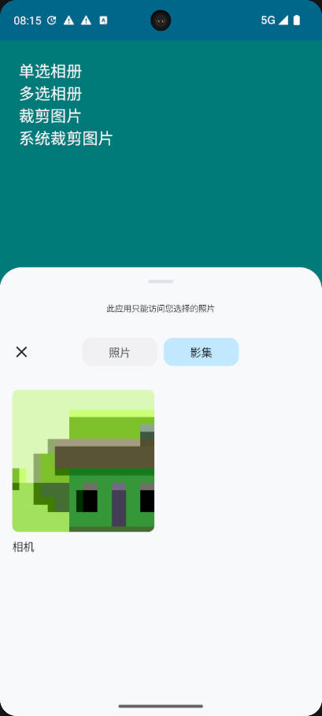
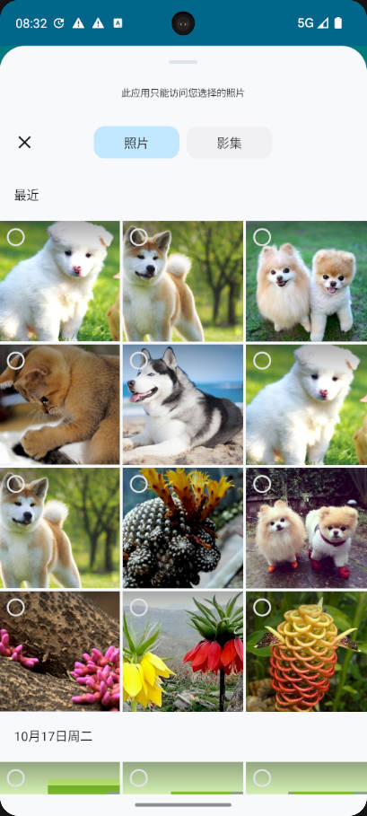
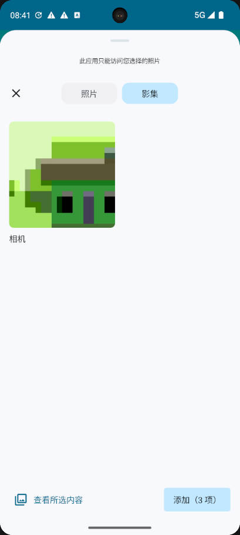
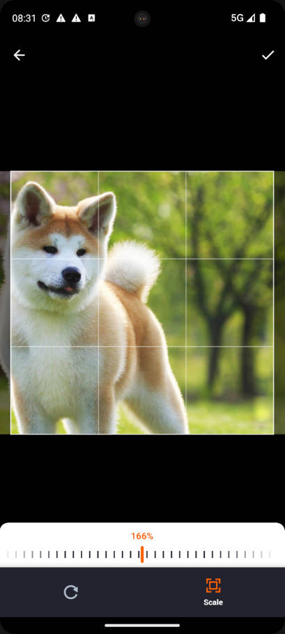
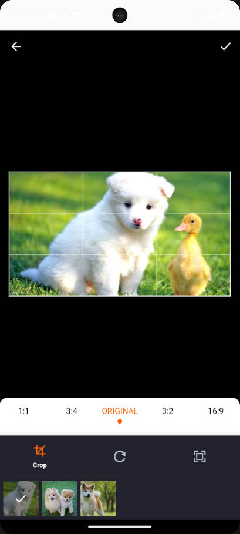

# PictureSelector 4.0
   A PictureSelector for Android platform, which supports obtaining pictures, videos, audio & photos from photo albums, cutting (single picture or multi picture cutting), compression, theme custom configuration and other functions, and supports dynamic access & an open source picture selection framework suitable for Android 5.0 + system<br> 
   
   [简体中文🇨🇳](README_CN.md)

   [Download Demo Apk](https://github.com/peihua8858/PictureSelector/demo/demo_2023-11-10_1721_v4.0.0.apk)<br>

[](https://github.com/peihua8858)
[](https://github.com/peihua8858)
[](https://github.com/peihua8858/PictureSelector)


## Contents
-[Latest version](https://github.com/peihua8858/PictureSelector/releases/tag/4.0.0-beta7)<br>
-[Download](#Download)<br>
-[Usage](#Usage)<br>
-[Permission](#Permission)<br>
-[Effect](#Effect)<br>
-[ProGuard](#ProGuard)<br>
-[Issues](https://github.com/peihua8858/PictureSelector/wiki/%E5%A6%82%E4%BD%95%E6%8F%90Issues%3F)<br>
-[License](#License)<br>


## Download

Use Gradle

```sh
repositories {
  google()
  mavenCentral()
}

dependencies {
  // PictureSelector
  implementation 'com.github.peihua8858:PictureSelector:4.0.0-beta7'
}
```

Or Maven:

```xml
<dependency>
  <groupId>com.github.peihua8858</groupId>
  <artifactId>pictureselector</artifactId>
  <version>4.0.0-beta7</version>
</dependency>
```

## Permission  

Permission describe，see [documentation](https://github.com/peihua8858/PictureSelector/wiki/PictureSelector-4.0-%E6%9D%83%E9%99%90%E4%BD%BF%E7%94%A8%E8%AF%B4%E6%98%8E)

```xml
<uses-permission android:name="android.permission.READ_EXTERNAL_STORAGE" />
<uses-permission android:name="android.permission.WRITE_EXTERNAL_STORAGE" />
<uses-permission android:name="android.permission.WRITE_MEDIA_STORAGE" />
<uses-permission android:name="android.permission.WRITE_SETTINGS" />
<uses-permission android:name="android.permission.MODIFY_AUDIO_SETTINGS" />
<uses-permission android:name="android.permission.MANAGE_EXTERNAL_STORAGE" />
<uses-permission android:name="android.permission.FOREGROUND_SERVICE" />
<uses-permission android:name="android.permission.RECORD_AUDIO" />
<uses-permission android:name="android.permission.CAMERA" />
<uses-permission android:name="android.permission.VIBRATE" />

<-- Android 13版本适配，细化存储权限 -->
<uses-permission android:name="android.permission.READ_MEDIA_IMAGES" />
<uses-permission android:name="android.permission.READ_MEDIA_AUDIO" />
<uses-permission android:name="android.permission.READ_MEDIA_VIDEO" />
```

Android 11 use camera，AndroidManifest.xm add the code：

```xml
<queries package="${applicationId}">
    <intent>
        <action android:name="android.media.action.IMAGE_CAPTURE">

        </action>
    </intent>
    <intent>
        <action android:name="android.media.action.ACTION_VIDEO_CAPTURE">

        </action>
    </intent>
</queries>
```

## ImageEngine
[RatioImageView](https://github.com/peihua8858/ImageLoader/blob/master/imageloader/src/main/java/com/fz/imageloader/widget/RatioImageView.kt)<br>
[ImageLoader](https://github.com/peihua8858/ImageLoader/blob/master/imageloader/src/main/java/com/fz/imageloader/ImageLoader.kt)<br>

## Usage

A simple use case is shown below:

1、Get picture 

```kotlin
//注册获取图片ActivityResultContract
private val takePictureLaunch = mActivity.registerForActivityResult(PhotoVisualMedia()) {
        if (it != null) {
           //todo 
        }
    }
//运行获取图片请求
//仅获取图片
takePictureLaunch.launch(PhotoVisualMediaRequest(PhotoVisualMedia.ImageOnly))
//获取图片及视频
takePictureLaunch.launch(PhotoVisualMediaRequest(PhotoVisualMedia.ImageAndVideo))
//仅获取视频
takePictureLaunch.launch(PhotoVisualMediaRequest(PhotoVisualMedia.VideoOnly))
//仅获取音频
takePictureLaunch.launch(PhotoVisualMediaRequest(PhotoVisualMedia.AudioOnly))
//仅获取mimeType指定的类型
takePictureLaunch.launch(PhotoVisualMediaRequest(PhotoVisualMedia.SingleMimeType(mimeType)))
//仅获取mimeTypes指定的类型
takePictureLaunch.launch(PhotoVisualMediaRequest(PhotoVisualMedia.MultipleMimeType(mimeTypes)))
```
2、裁剪图片
```kotlin
private val takeCropLaunch = mActivity.registerForActivityResult(PhotoCropVisualMedia()) {
        if (it.resultCode == Activity.RESULT_OK) {
            val intent = it.data
            val uri = if (intent?.data != null) {
                intent.data
            } else {
                val url = intent?.action
                if (url.isNonEmpty()) {
                    Uri.parse(url)
                } else null
            }
            if (uri != null) {
               //todo
            }
        }
    }
    val outputFile = "IMG_".createFile("jpg")
    val outputUri = Uri.fromFile(outputFile)
     takeCropLaunch.launch(
             PhotoCropVisualMediaRequestBuilder(uri, outputUri)
                    .withAspectRatio(1f, 1f)
                    .withMaxResultSize(200, 200)
                    .setCircleDimmedLayer(true)
                    .build()
            )

```

## ProGuard
```sh
-keep class com.peihua.selector.** { *; }
```
## License
```sh
Copyright 2023 peihua

Licensed under the Apache License, Version 2.0 (the "License");
you may not use this file except in compliance with the License.
You may obtain a copy of the License at

http://www.apache.org/licenses/LICENSE-2.0

Unless required by applicable law or agreed to in writing, software
distributed under the License is distributed on an "AS IS" BASIS,
WITHOUT WARRANTIES OR CONDITIONS OF ANY KIND, either express or implied.
See the License for the specific language governing permissions and
limitations under the License.
```


## Effect

|          单选图片          |           预览           |           相册           |
|:----------------------:|:----------------------:|:----------------------:|
|  |  |  |

|          多选图片          |           预览           |           相册           |
|:----------------------:|:----------------------:|:----------------------:|
|  |  |  |

|           单图裁剪           |          多图裁剪           |
|:------------------------:|:-----------------------:|
|    |  |
