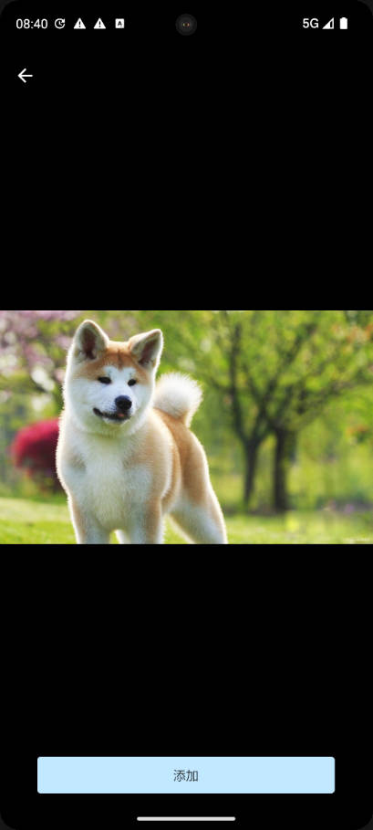
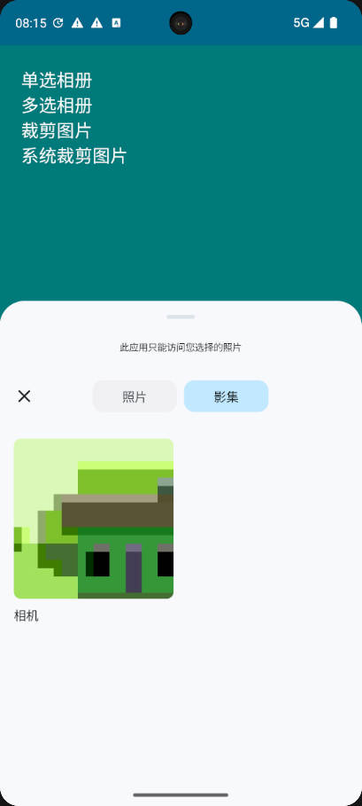
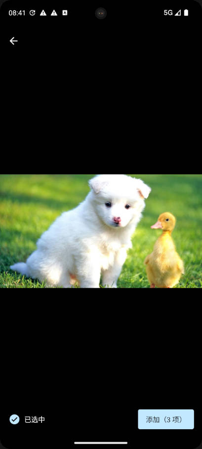
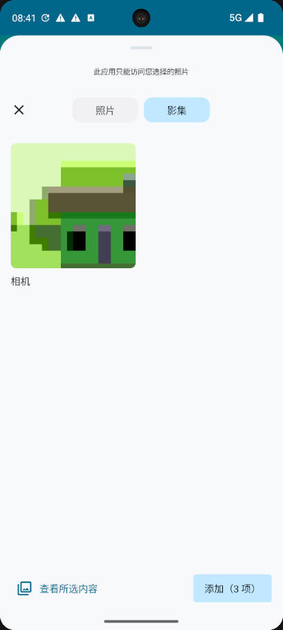
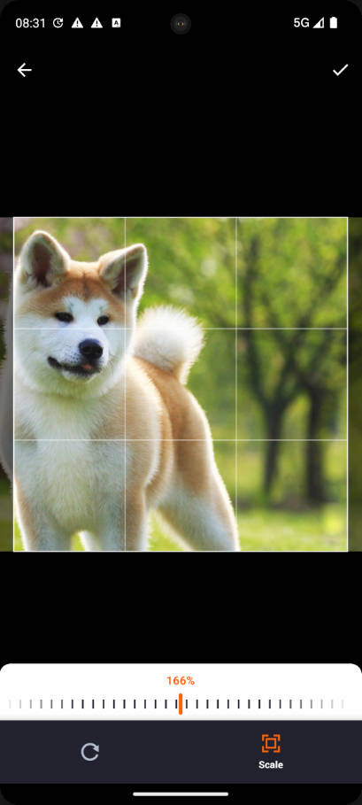
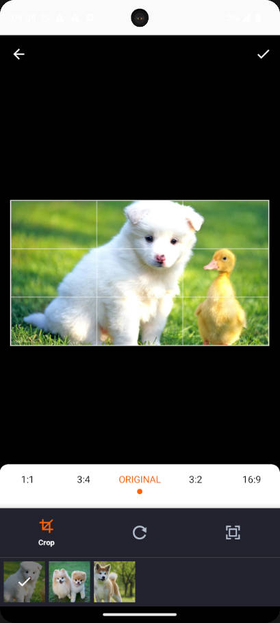

# PictureSelector 4.0
   一款针对Android平台下的图片选择器，支持从相册获取图片、视频、音频&拍照，支持裁剪(单图or多图裁剪)、压缩、主题自定义配置等功能，支持动态获取权限&适配Android 5.0+系统的开源图片选择框架。<br>
    
   [English🇺🇸](README.md)

   [效果体验](https://github.com/peihua8858/PictureSelector/raw/master/demo/demo_2023-11-10_1721_v4.0.0.apk)<br>

[](https://github.com/peihua8858)
[](https://github.com/peihua8858)
[](https://github.com/peihua8858/PictureSelector)


## 目录
-[最新版本](https://github.com/peihua8858/PictureSelector/releases/tag/4.0.0-beta7)<br>
-[如何引用](#如何引用)<br>
-[进阶使用](#进阶使用)<br>
-[权限](#权限)<br>
-[演示效果](#演示效果)<br>
-[混淆配置](#混淆配置)<br>
-[如何提Issues](https://github.com/peihua8858/PictureSelector/wiki/%E5%A6%82%E4%BD%95%E6%8F%90Issues%3F)<br>
-[兼容性测试](#兼容性测试)<br>
-[联系方式](#联系方式)<br>
-[License](#License)<br>


## 如何引用

使用Gradle
```sh
repositories {
  google()
  mavenCentral()
}

dependencies {
  // PictureSelector
  implementation 'com.github.peihua8858:PictureSelector:4.0.0-beta7'
}
```

或者Maven:

```xml
<dependency>
  <groupId>com.github.peihua8858</groupId>
  <artifactId>pictureselector</artifactId>
  <version>4.0.0-beta7</version>
</dependency>
```

## 权限

权限使用说明，请参阅 [文档](https://github.com/peihua8858/PictureSelector/wiki/PictureSelector-4.0-%E6%9D%83%E9%99%90%E4%BD%BF%E7%94%A8%E8%AF%B4%E6%98%8E)

```xml
<uses-permission android:name="android.permission.READ_EXTERNAL_STORAGE" />
<uses-permission android:name="android.permission.WRITE_EXTERNAL_STORAGE" />
<uses-permission android:name="android.permission.WRITE_MEDIA_STORAGE" />
<uses-permission android:name="android.permission.WRITE_SETTINGS" />
<uses-permission android:name="android.permission.MODIFY_AUDIO_SETTINGS" />
<uses-permission android:name="android.permission.MANAGE_EXTERNAL_STORAGE" />
<uses-permission android:name="android.permission.FOREGROUND_SERVICE" />
<uses-permission android:name="android.permission.RECORD_AUDIO" />
<uses-permission android:name="android.permission.CAMERA" />
<uses-permission android:name="android.permission.VIBRATE" />

<-- Android 13版本适配，细化存储权限 -->
<uses-permission android:name="android.permission.READ_MEDIA_IMAGES" />
<uses-permission android:name="android.permission.READ_MEDIA_AUDIO" />
<uses-permission android:name="android.permission.READ_MEDIA_VIDEO" />
```

Android 11 使用相机，需要再AndroidManifest.xm 添加如下代码：

```xml
<queries package="${applicationId}">
    <intent>
        <action android:name="android.media.action.IMAGE_CAPTURE">

        </action>
    </intent>
    <intent>
        <action android:name="android.media.action.ACTION_VIDEO_CAPTURE">

        </action>
    </intent>
</queries>
```

## ImageEngine
[RatioImageView](https://github.com/peihua8858/ImageLoader/blob/master/imageloader/src/main/java/com/fz/imageloader/widget/RatioImageView.kt)<br> 
[ImageLoader](https://github.com/peihua8858/ImageLoader/blob/master/imageloader/src/main/java/com/fz/imageloader/ImageLoader.kt)<br>


## 进阶使用

简单用例如下所示:

1、获取图片

```kotlin
//注册获取图片ActivityResultContract
private val takePictureLaunch = mActivity.registerForActivityResult(PhotoVisualMedia()) {
        if (it != null) {
           //todo 
        }
    }
//运行获取图片请求
//仅获取图片
takePictureLaunch.launch(PhotoVisualMediaRequest(PhotoVisualMedia.ImageOnly))
//获取图片及视频
takePictureLaunch.launch(PhotoVisualMediaRequest(PhotoVisualMedia.ImageAndVideo))
//仅获取视频
takePictureLaunch.launch(PhotoVisualMediaRequest(PhotoVisualMedia.VideoOnly))
//仅获取音频
takePictureLaunch.launch(PhotoVisualMediaRequest(PhotoVisualMedia.AudioOnly))
//仅获取mimeType指定的类型
takePictureLaunch.launch(PhotoVisualMediaRequest(PhotoVisualMedia.SingleMimeType(mimeType)))
//仅获取mimeTypes指定的类型
takePictureLaunch.launch(PhotoVisualMediaRequest(PhotoVisualMedia.MultipleMimeType(mimeTypes)))
```
2、裁剪图片
```kotlin
private val takeCropLaunch = mActivity.registerForActivityResult(PhotoCropVisualMedia()) {
        if (it.resultCode == Activity.RESULT_OK) {
            val intent = it.data
            val uri = if (intent?.data != null) {
                intent.data
            } else {
                val url = intent?.action
                if (url.isNonEmpty()) {
                    Uri.parse(url)
                } else null
            }
            if (uri != null) {
               //todo
            }
        }
    }
    val outputFile = "IMG_".createFile("jpg")
    val outputUri = Uri.fromFile(outputFile)
     takeCropLaunch.launch(
             PhotoCropVisualMediaRequestBuilder(uri, outputUri)
                    .withAspectRatio(1f, 1f)
                    .withMaxResultSize(200, 200)
                    .setCircleDimmedLayer(true)
                    .build()
            )

```


## 混淆配置 
```sh
-keep class com.peihua.selector.** { *; }
```
## License
```sh
Copyright 2023 peihua

Licensed under the Apache License, Version 2.0 (the "License");
you may not use this file except in compliance with the License.
You may obtain a copy of the License at

http://www.apache.org/licenses/LICENSE-2.0

Unless required by applicable law or agreed to in writing, software
distributed under the License is distributed on an "AS IS" BASIS,
WITHOUT WARRANTIES OR CONDITIONS OF ANY KIND, either express or implied.
See the License for the specific language governing permissions and
limitations under the License.
```


## 兼容性测试
******腾讯优测-深度测试-通过率达到100%******


## 演示效果

|          单选图片          |           预览           |           相册           |
|:----------------------:|:----------------------:|:----------------------:|
|  |  |  |

|          多选图片          |           预览           |           相册           |
|:----------------------:|:----------------------:|:----------------------:|
|  |  |  |

|           单图裁剪           |          多图裁剪           |
|:------------------------:|:-----------------------:|
|    |  |


